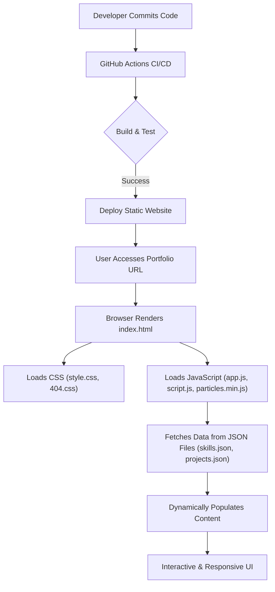

# 🚀 Dynamic Portfolio Website

<p align="center"></p>

## Short Description
Unleash your professional story with the **Dynamic Portfolio Website** – a beautifully crafted, highly responsive, and interactive online platform designed to showcase your skills, experience, and projects with unparalleled elegance. This static site leverages modern web technologies to deliver a lightning-fast and engaging user experience, complete with dynamic content loading and automated deployment.

## ✨ Key Features
*   **Stunning & Responsive Design:** A sleek, modern user interface that looks fantastic on any device, from desktops to mobile phones.
*   **Interactive Experience:** Engage visitors with dynamic animations, particle effects, and smooth transitions that bring your profile to life.
*   **Dynamic Content Loading:** Easily manage and update your skills and projects through simple JSON files, making content updates a breeze without touching the core code.
*   **Dedicated Sections:** Clearly organized sections for your projects, professional experience, and contact information, ensuring visitors can quickly find what they need.
*   **Integrated Resume:** Provide immediate access to your detailed professional resume with a dedicated PDF link.
*   **Custom 404 Page:** A branded and user-friendly custom error page enhances the overall user experience.
*   **Automated Deployment (CI/CD):** Streamlined development with GitHub Actions for continuous integration and continuous deployment, ensuring your latest work is always live.

## Who is this for?
This project is ideal for **developers, designers, freelancers, and professionals** seeking a modern, maintainable, and impressive online portfolio. If you want to make a lasting impression on recruiters, potential clients, or collaborators, and prefer a powerful static site approach over complex backend systems, this is for you.

## Technology Stack & Architecture
This portfolio website is a testament to robust frontend development and modern deployment practices.
*   **Frontend:** HTML5, CSS3, JavaScript (Vanilla JS for interactive elements, `particles.min.js` for visual effects).
*   **Data Management:** JSON files (`projects.json`, `skills.json`) for flexible and easy content updates.
*   **Development Tools:** VS Code for streamlined coding.
*   **Continuous Integration/Deployment (CI/CD):** GitHub Actions (`.github/workflows/ci-cd.yml`) for automated testing and deployment.
*   **Assets:** Organized `assests` directory for images, stylesheets, and scripts.

## 📊 Architecture & Database Schema



## ⚡ Quick Start Guide

Ready to launch your own professional portfolio? Follow these simple steps:

1.  **Clone the Repository:**
    ```bash
    git clone https://github.com/saisuhasyamsani-del/portfolio_website.git
    cd portfolio_website
    ```

2.  **Open in Browser:**
    Simply open the `index.html` file in your preferred web browser.
    ```bash
    # For Linux/macOS
    open index.html
    # For Windows
    start index.html
    ```
    Alternatively, right-click `index.html` and choose "Open with Live Server" if you have the VS Code extension, or just "Open with [Your Browser]".

3.  **Customize Your Content:**
    *   Edit `skills.json` to update your technical proficiencies.
    *   Modify `projects/projects.json` to showcase your latest work.
    *   Update `assests/resume.pdf` with your personal resume.
    *   Personalize `index.html`, `experience/index.html`, and `projects/index.html` with your details.

4.  **Deploy (Optional):**
    For live deployment, push your changes to GitHub. The integrated CI/CD pipeline (via GitHub Actions) can be configured to automatically deploy to platforms like GitHub Pages, Netlify, or Vercel.

## 📜 License
This project is licensed under the MIT License. See the `LICENSE` file for more details.